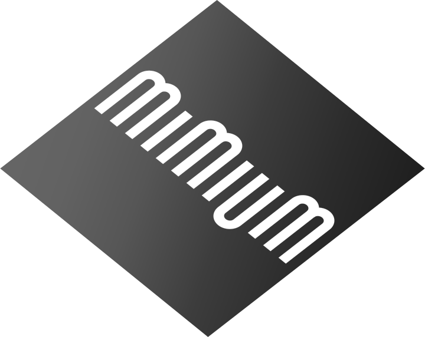

# mimium

a programming language as an infrastructure for sound and music

stable: [](https://github.com/mimium-org/mimium/actions) dev: [](https://github.com/mimium-org/mimium/actions) [](https://www.codacy.com/gh/mimium-org/mimium/dashboard?utm_source=github.com&amp;utm_medium=referral&amp;utm_content=mimium-org/mimium&amp;utm_campaign=Badge_Grade)

[](https://mimium.org) [](https://gitter.im/mimium-dev/community?utm_source=badge&utm_medium=badge&utm_campaign=pr-badge) [](./LICENSE.md)



mimium(*MInimal-Musical-medIUM*) is a programming language for sound and music.

mimium is made to be an infrastructure for distributing music in a form of a source code, not only a tool for musicians and programmers.

Its syntax and semantics are technically inspired from several modern programming languages for sound such as *[Faust](https://faust.grame.fr)* and *[Extempore](https://extemporelang.github.io/)*.

You can write various expression from low-level signal processing to note-level processing with a simple syntax and high-performance.
Since all the code is executed with JIT compilation using LLVM which has an equivalent performance as the dsp code written in general purpose languages such as C++.

A minimal example below generates a sinewave of 440Hz.

```rust
// minimal.mmm
twopi = 3.141595*2
sr = 48000
fn dsp(){
    out = sin(now * 440 * twopi / sr)
    return (out,out)
}
```

To run the code, type `mimium path/minimal.mmm` on your terminal application.

A special keyword `self` can be used in function, which is a last return value of the function.
This enables an easy and clean expression of feedback connection of signal chain.

```rust
fn lpf(input:float,fb:float){    
    return (1-fb)*input + fb*self
}
```

You can also write a note-level processing by using `@` operator which specifies the time when the function will be executed. Another special keyword `now` can be used for getting current logical time.
An event scheduling is sample-accurate because the scheduler is driven by an audio driver.

```rust
freq = 440
fn noteloop()->void{
    freq = (freq+1200)%4000
    noteloop()@(now + 48000)
}
```

More specific infos about the language are on [mimium Website](https://mimium.org).

## Installation

mimium can be run on macOS(x86), Linux(ALSA backend), Windows(WASAPI backend). WebAssemby backend will be supported for future.

An easiest way to getting started is to use [Visual Studio Code extension](https://marketplace.visualstudio.com/items?itemName=mimium-org.mimium-language). Search "mimium" in extension tab and install it. When you create & open the file with the file extension `.mmm`, you will be asked to install the latest binary. The extension also contains syntax highlights for `.mmm` files.

On macOS and Linux, installation via [Homebrew](https://brew.sh/) is recommended.

You can install mimium with a command as follows.

```sh
brew install mimium-org/mimium/mimium
```

Also, you can get a built binary from [release](https://github.com/mimium-org/mimium/releases) section.
## Build from Source

To build on Windows, you need to use MSYS2. For details, check [GitHub Action Workflow](https://github.com/mimium-org/mimium/blob/dev/.github/workflows/build_and_test.yml).
### Dependencies

- cmake
- bison >= 3.3
- flex
- llvm >= 11
- Libsndfile
- RtAudio(cmake will automatically download)

```sh
git clone https://github.com/mimium-org/mimium
cd mimium
# configure. if you want to install to specific directory, add -DCMAKE_INSTALL_PREFIX=/your/directory
cmake -Bbuild
# build
cmake --build build -j
# install
cmake --build build --target install
```
## Author

Tomoya Matsuura/松浦知也

<https://matsuuratomoya.com/en>

## [License](LICENSE.md)

The source code is lisenced under [Mozilla Puclic License 2.0](LICENSE.md).

The source code contains third party libraries with BSD-like lincenses, see [COPYRIGHT](./COPYRIGHT).

## Acknowledgements

This project is supported by all the contributers, [Sponsors](https://github.com/sponsors/tomoyanonymous), grants and scholarships as follows.

- 2019 Exploratory IT Human Resources Project ([The MITOU Program](https://www.ipa.go.jp/jinzai/mitou/portal_index.html)) by IPA: INFORMATION-TECHNOLOGY PROMOTION AGENCY, Japan.
- Kakehashi Foundation

### Contributors

<!-- ALL-CONTRIBUTORS-BADGE:START - Do not remove or modify this section -->
[](#contributors)
<!-- ALL-CONTRIBUTORS-BADGE:END --> 

	
<!-- ALL-CONTRIBUTORS-LIST:START - Do not remove or modify this section -->
<!-- prettier-ignore-start -->
<!-- markdownlint-disable -->
<table>
  <tr>
    <td align="center"><a href="https://t-sin.github.io"><br /><sub><b>Shinichi Tanaka</b></sub></a></td>
    <td align="center"><a href="http://deepdrilledwell.secret.jp/ddw/"><br /><sub><b>kyo</b></sub></a></td>
    <td align="center"><a href="http://baku89.com"><br /><sub><b>Baku 麦</b></sub></a></td>
    <td align="center"><a href="https://github.com/yuichkun"><br /><sub><b>Yuichi Yogo</b></sub></a></td>
  </tr>
</table>

<!-- markdownlint-restore -->
<!-- prettier-ignore-end -->

<!-- ALL-CONTRIBUTORS-LIST:END -->